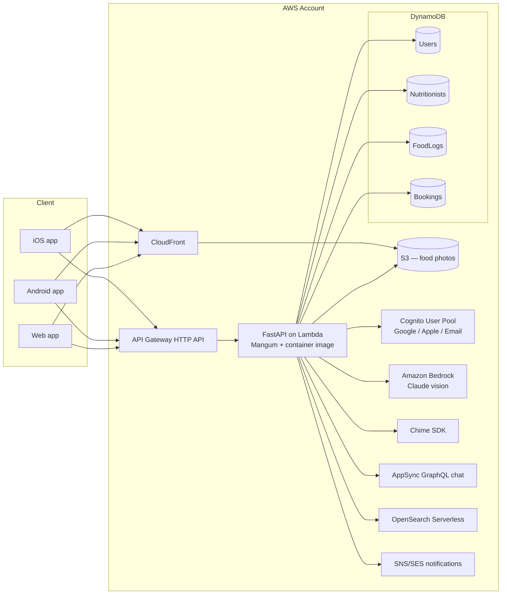

# NutriWise Architecture

## Context

NutriWise is a two-sided marketplace connecting customers with certified
nutritionists, augmented with AI-assisted meal tracking. We target US and
Indian metropolitan markets with country-aware pricing, dietary preferences
(Jain, eggetarian, etc.), and credential models (RDN/RD/CNS vs IDA-RD/BSc/MSc).

## System diagram

## Tiers

**Client** — React Native via Expo. Single codebase targets iOS, Android, and
web builds. Expo Router (file-based) drives navigation. Camera and image
picker are used for the meal logging flow.

**Edge** — CloudFront fronts the S3 photo bucket for thumbnail delivery. The
API itself is reached directly through API Gateway (HTTPS termination is
handled there).

**API** — FastAPI runs as a container image on Lambda. Mangum adapts the ASGI
app to the Lambda event model. We picked containers over zip so we don't have
to hand-manage binary wheels for `cryptography` or `asyncpg`.

**Auth** — Cognito user pool with three groups (`customers`,
`nutritionists`, `admins`). Google and Apple are wired via federated identity
providers (Phase 1). Access tokens are JWTs validated server-side using the
pool's JWKS; for phase 0 the API also honors an `X-User-Id` dev header when
the Cognito pool id isn't configured.

**Data** — DynamoDB is the primary store for high-read, low-coupling entities
(users, nutritionists, food logs, bookings). Table shapes:

| Table | PK | SK | GSIs | Access pattern |
|---|---|---|---|---|
| `users` | `user_id` | — | — | look up a customer by id |
| `nutritionists` | `nutritionist_id` | — | `by_country_city` | regional discovery |
| `food_logs` | `user_id` | `logged_at` | — | a user's day as a range query |
| `bookings` | `booking_id` | — | `by_nutritionist_start`, `by_user_start` | conflict checks + user history |

Aurora Serverless v2 (Postgres) is reserved for relational workloads we'll
add later — payments, invoices, and audit history that benefit from joins.

**AI** — Amazon Bedrock hosts Claude 4. The API calls `client.messages.parse`
with a base64-encoded meal image and a Pydantic response schema
(`FoodPhotoAnalysis`). Totals are recomputed server-side from per-item values
so rounding drift doesn't leak to the client.

**Realtime** (Phase 1) — AppSync GraphQL subscriptions for customer ↔
nutritionist chat. Chime SDK meetings are created on booking confirmation and
the meeting ID is stored on the booking record.

**Search** (Phase 1) — OpenSearch Serverless indexes verified nutritionists
for `/v1/nutritionists` queries that combine city + specialty + language +
rating filters.

**Notifications** — SNS + SES for booking confirmations and reminders.

## Request flow: food photo analysis

1. User taps "Analyze photo" in the mobile app.
2. App POSTs `multipart/form-data` with the JPEG bytes to `/v1/food/analyze`.
3. Lambda handler reads bytes, invokes Bedrock with the image and a system
   prompt that constrains the model to a nutrition-analyst role.
4. Response is parsed into `FoodPhotoAnalysis` via structured outputs. Totals
   are recomputed from `items[*]`.
5. The analysis is returned to the client. The user confirms and logs it via
   `POST /v1/food/logs`, which persists to DynamoDB.

## Deployment

Four CDK stacks per environment (`dev`, `staging`, `prod`):

- `Auth` — user pool, groups, mobile client
- `Data` — DynamoDB tables with GSIs
- `Media` — S3 bucket + CloudFront
- `Api` — Lambda + API Gateway HTTP API

Non-prod stacks use `RemovalPolicy.DESTROY` for cheap teardown; prod retains
stateful resources. Cross-stack references pass Cognito pool, tables, and
bucket into `ApiStack` so Lambda has IAM wired at synth time.

## Phase 0 vs Phase 1

Phase 0 (this repo): backend is runnable with in-memory stores; mobile app
talks to a local FastAPI; CDK synthesizes cleanly.

Phase 1:

- Swap in-memory stores for DynamoDB (DAOs in `api/app/repositories/`).
- Wire Cognito JWKS validation in `app/core/security.py`.
- Integrate Chime SDK meeting creation in `POST /v1/bookings`.
- AppSync schema + subscription resolvers for chat.
- OpenSearch index + `/v1/nutritionists` search routing.
- Admin verification dashboard (web only).
- Subscription billing (Stripe) + nutritionist payouts.
